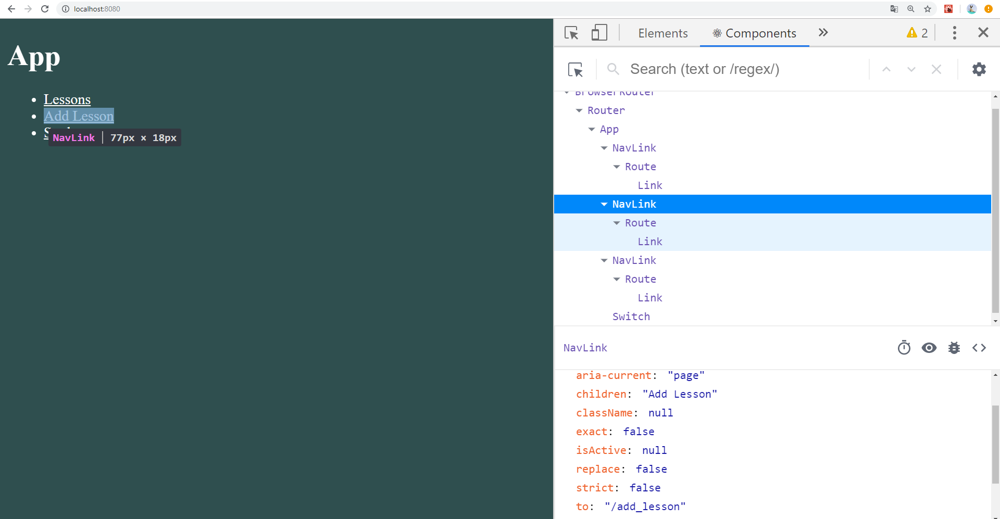
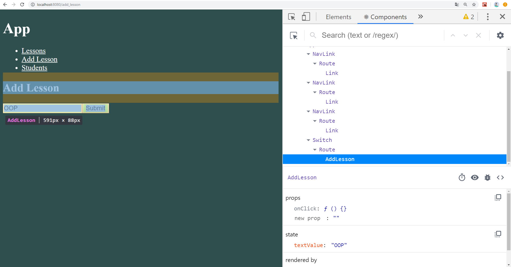
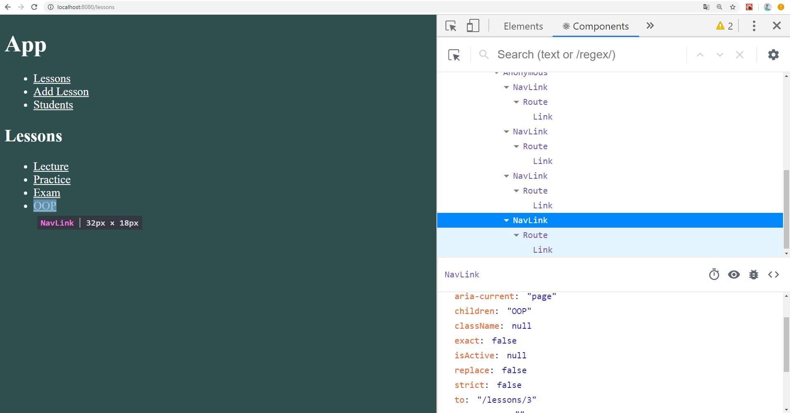
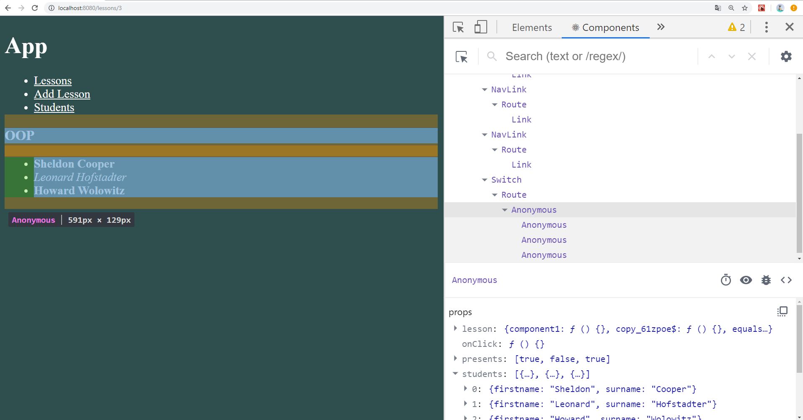

# KotlinJS 2.4
---
Введение в React Route
-----------------------------------
### 1. Начальное состояние компонента App 

### 2. Компонент AddLesson

### 3. Состояние компонента LessonList после нажатия на кнопку в компоненте AddLesson 

### 4. Состояние компонента LessonFull для нового Lesson после нажатия на студента
